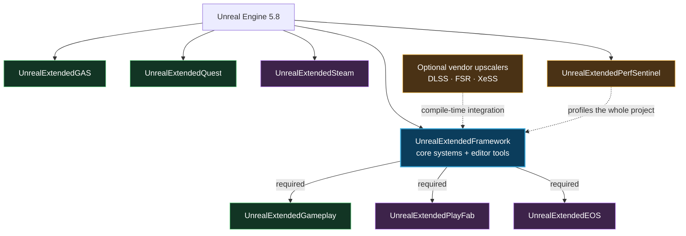

<p align="center">
  
</p>

<h1 align="center">Unreal Extended Framework</h1>

<p align="center">
  <strong>A modular gameplay, online-services, tooling, and performance suite for Unreal Engine 5.8.</strong>
</p>

<p align="center">
  Build the parts your project needs. Keep the parts it does not out of the way.
</p>

<p align="center">
  
  
  
  
</p>

<p align="center">
  <a href="#-the-suite">The Suite</a> ·
  <a href="#-feature-highlights">Features</a> ·
  <a href="#-installation">Installation</a> ·
  <a href="#-quick-start">Quick Start</a> ·
  <a href="#-dependencies">Dependencies</a> ·
  <a href="#-testing-and-validation">Testing</a> ·
  <a href="#-license">License</a>
</p>

---

Unreal Extended Framework is a collection of focused Unreal Engine plugins for projects that need more than a small utility library but do not want a single, tightly coupled framework. It combines reusable runtime systems, gameplay building blocks, a Gameplay Ability System layer, a graph-based quest system, online-service integrations, editor workflows, and evidence-driven performance tooling.

Each plugin has its own descriptor and module boundary. Install the full repository once, then enable only the capabilities your project needs.

> [!IMPORTANT]
> This repository targets **Unreal Engine 5.8**. Earlier engine versions may require API and build-rule changes.

## ✨ Why Extended Framework?

- **Modular by design** — eight separately enableable plugins instead of one monolith.
- **Blueprint-friendly** — subsystems, async actions, actor components, settings, and data types are exposed where appropriate.
- **C++ ready** — explicit module boundaries and reusable public APIs for native projects.
- **Runtime + editor workflows** — gameplay systems are paired with validation, authoring, reporting, and debugging tools.
- **Online-service breadth** — EOS, PlayFab, and Steam integrations live behind dedicated modules.
- **Production-minded systems** — persistence, replication, diagnostics, commandlets, automation tests, and performance evidence are first-class concerns.
- **Selective adoption** — the core is useful by itself, while several specialized plugins can also stand alone.

## 🧩 The Suite

| Plugin | Role | Highlights | Version |
|:--|:--|:--|:--:|
| [**UnrealExtendedFramework**](UnrealExtendedFramework/) | Core runtime and editor foundation | Modular settings, Blueprint libraries, async nodes, AI/EQS helpers, subtitles, HTTP/JSON, UI Lab, localization tooling | `1.0` |
| [**UnrealExtendedGameplay**](UnrealExtendedGameplay/) | Reusable gameplay systems | Combat, targeting, cover, traversal, perception, footsteps, input buffering, outlines, spawners, animation notifies | `1.0` |
| [**UnrealExtendedGAS**](UnrealExtendedGAS/) | Gameplay Ability System extensions | Ability sets, ASC/attribute bases, effect components, async listeners, ability tasks, debug UI | `1.0` |
| [**UnrealExtendedQuest**](UnrealExtendedQuest/) | Runtime and editor quest framework | Custom graph editor, stages/objectives, facts, replication, JSON I/O, simulator, search, debugger, commandlets | `1.0` |
| [**UnrealExtendedPlayFab**](UnrealExtendedPlayFab/) | PlayFab client integration | Authentication, player data, inventory, currency, matchmaking, CloudScript, groups, analytics, async Blueprint actions | `1.0` |
| [**UnrealExtendedEOS**](UnrealExtendedEOS/) | Epic Online Services integration | Auth/connect, sessions, lobbies, matchmaking, social, stats, achievements, storage, voice, anti-cheat, e-commerce | `1.0` |
| [**UnrealExtendedSteam**](UnrealExtendedSteam/) | Steamworks, OSS, sockets, and Web API | Client/server APIs, custom online subsystem, networking, async Blueprint nodes, Web API, publishing tools | `0.1.0` |
| [**UnrealExtendedPerfSentinel**](UnrealExtendedPerfSentinel/) | Performance capture and regression analysis | Trace capture, stat harvesting, deterministic analysis, budget gates, spike evidence, editor reports | `1.0.0` beta |

### How the pieces fit together



> [!NOTE]
> `UnrealExtendedGAS`, `UnrealExtendedQuest`, `UnrealExtendedSteam`, and `UnrealExtendedPerfSentinel` do not require the core plugin in their descriptors. Gameplay, PlayFab, and EOS do.

## 🚀 Feature Highlights

### 🧱 Core Framework

The core plugin supplies the shared runtime and editor foundation used across the suite.

**Runtime systems**

- Data-driven modular settings with local, world, and player scopes.
- Apply, revert, reset, snapshot, synchronous save/load, and asynchronous persistence workflows.
- Graphics, audio, display, input, accessibility, and upscaler-oriented setting types.
- Optional compile-time integration for NVIDIA DLSS, AMD FSR variants, and Intel XeSS.
- Async Blueprint actions for delays, loops, timelines, input, gameplay tags, and character movement.
- HTTP and JSON helpers for backend-facing gameplay code.
- Actor, AI, array, condition, conversion, data-table, file, input, math, monitor, perception, trace, variable, and widget libraries.
- Subtitle data, style profiles, project settings, playback, and presentation support.
- Behavior Tree composites, decorators, services, and tasks.
- EQS contexts, generators, and tests for tactical AI queries.
- Custom animation nodes and editor graph-node support.

**Editor systems**

- UI Lab fixtures, providers, focus/input tooling, scripted interaction, and automation support.
- Localization workbench with glossary, context, validation, review, pseudo-localization, providers, and pipeline tooling.
- Editor utilities and cheat-manager helpers.

### 🎮 Extended Gameplay

Composable components and actors for common action-game needs:

- Area damage actors and data-driven enemy spawning.
- Sight, hearing, faction sense, stimuli sources, and procedural patrol generation.
- Damage reactions and stat components.
- Cover, ladder, mantle/ledge, line-of-sight, and targeting systems.
- Footstep handling and input buffering.
- Basic and advanced outline components, symbols, and helper library.
- Feet IK animation support.
- Animation notifies for damage traces, camera shake, movement control, particles, perception noise, montage control, play rate, slow motion, and soft lock.
- Input-image widgets for player-facing control prompts.

### ⚡ Extended GAS

A focused extension layer over Unreal's Gameplay Ability System:

- Base ability-system component, attribute set, and gameplay ability classes.
- Data-driven ability sets for granting abilities, effects, and attributes.
- Blueprint function library for common GAS operations.
- Effect components for attribute requirements, attribute mutations, and ability activation.
- Async listeners for attributes, cooldowns, effect stacks, and gameplay-tag changes.
- Ability tasks for timers, per-frame work, curves, montage events, rotation, look-at behavior, and component movement.
- Regeneration magnitude calculation and an ability debug widget.

### 🗺️ Extended Quest

A server-authoritative, graph-authored quest system with a dedicated editor:

- Quest graphs composed from stages, objectives, start/end nodes, custom nodes, predicates, events, and directives.
- Replicated immutable view snapshots for client UI.
- Facts, roles, target registry, clocks, memory, trackers, and gameplay-event processing.
- Runtime simulation and diagnostics.
- JSON parsing and writing for quest data pipelines.
- Quest Browser, graph search, details customization, custom thumbnails, and graph tooling.
- Gameplay Debugger integration.
- Validation and statistics commandlets for automation and CI.
- Included Python utilities for human-text conversion, spell checking, and legacy orientation workflows.

### ☁️ Extended PlayFab

A subsystem-oriented PlayFab integration with matching asynchronous Blueprint actions:

- Authentication and account linking.
- Player profile, player data, shared data, characters, entity files, and ID lookup.
- Inventory, virtual currency, trading, content delivery, and title data/news.
- Friends, groups, messages, push notifications, and segmentation.
- Statistics, leaderboards, analytics, reporting, and advertising.
- Matchmaking and CloudScript execution.
- Connection monitoring and shared typed responses.

### 🌐 Extended EOS

Epic Online Services features organized into focused runtime subsystems:

- EOS Auth and Connect login flows.
- Sessions, lobbies, search coordination, and matchmaking.
- Friends, presence, user information, and chat.
- Achievements, stats, and leaderboards.
- Player Data Storage and Title Storage.
- P2P networking, voice, UI overlay, and custom invites.
- Sanctions, reports, metrics, progression snapshots, and anti-cheat client/server support.
- E-commerce catalog, entitlement, ownership, and checkout support.
- Shared result types plus asynchronous Blueprint actions.

### 🔥 Extended Steam

A desktop-focused Steam integration split into small runtime and editor modules:

- Steamworks lifecycle ownership and shared typed APIs.
- Custom `OnlineSubsystemExtendedSteam` implementation.
- Identity, sessions, friends, presence, achievements, leaderboards, cloud storage, external UI, voice, auth, and encrypted app-ticket interfaces.
- Client, game-server, inventory, input, matchmaking, server browser, networking, remote play, screenshots, stats, storage, UGC, timeline, video, voice, and utility subsystems.
- Steam Networking Sockets subsystem, socket implementation, and net driver.
- Async Blueprint actions for major Steam interfaces.
- HTTP/JSON Steam Web API clients covering apps, economy, inventory, leaderboards, lobbies, microtransactions, news, published files, remote storage, users, and user stats.
- Editor publishing workflow for Steam content builds.

> [!WARNING]
> Steam modules are restricted to **Win64, Linux, and macOS** by the plugin descriptor. Access to and redistribution of the Steamworks SDK are governed by Valve's terms.

### 📈 Perf Sentinel

Performance tooling for repeatable capture, analysis, and reporting:

- Unreal Insights trace capture orchestration.
- Runtime monitoring and stat harvesting.
- Scenario names, capture profiles, budget profiles, and analysis requests.
- Deterministic external analysis through the included Python runner.
- Regression gates, worst-frame evidence, spike snapshots, and report generation.
- Editor menu, report viewer, and analyze commandlet.
- Console-driven workflows suitable for local profiling or automation.

```text
PerfSentinel.StartCapture MyScenario
PerfSentinel.StopCapture
PerfSentinel.AnalyzeLastTrace
PerfSentinel.AnalysisStatus
```

## 📋 Requirements

| Requirement | Notes |
|:--|:--|
| Unreal Engine | **5.8** |
| Project type | C++ project, or a Blueprint project converted to C++ by adding a native class |
| Toolchain | A compiler supported by UE 5.8 for the target platform |
| Core engine plugins | Enabled automatically through each `.uplugin` dependency declaration |
| Service accounts | Required only for the online provider you enable |
| Steamworks SDK | Obtain through an authorized Steamworks account and follow [the Steam plugin license](UnrealExtendedSteam/LICENSE) |

## 📦 Installation

### Option A — clone into a project

From the root of your Unreal project:

```bash
git clone https://github.com/ElderDeveloper/UnrealExtendedFramework.git Plugins/ExtendedFramework
```

The resulting layout should be:

```text
YourProject/
├── YourProject.uproject
└── Plugins/
    └── ExtendedFramework/
        ├── UnrealExtendedFramework/
        ├── UnrealExtendedGameplay/
        ├── UnrealExtendedGAS/
        ├── UnrealExtendedQuest/
        ├── UnrealExtendedPlayFab/
        ├── UnrealExtendedEOS/
        ├── UnrealExtendedSteam/
        └── UnrealExtendedPerfSentinel/
```

### Option B — download a source archive

1. Download and extract the repository.
2. Place the extracted folder at `YourProject/Plugins/ExtendedFramework`.
3. Confirm that each selected plugin's `.uplugin` file is below that directory.

### Enable and build

1. Open **Edit → Plugins** in Unreal Editor.
2. Search for the **Extended** category.
3. Enable only the plugins you intend to use.
4. Restart the editor when prompted.
5. Regenerate project files if necessary, then build the editor target.

You can also enable plugins directly in your `.uproject`:

```json
{
  "Plugins": [
    { "Name": "UnrealExtendedFramework", "Enabled": true },
    { "Name": "UnrealExtendedGameplay", "Enabled": true },
    { "Name": "UnrealExtendedGAS", "Enabled": true },
    { "Name": "UnrealExtendedQuest", "Enabled": true }
  ]
}
```

> [!TIP]
> Start with `UnrealExtendedFramework`, then add one specialized plugin at a time. This keeps configuration and service credentials easy to reason about.

## 🔗 Dependencies

All required non-vendor dependencies below ship with the local UE 5.8 installation.

| Plugin | Extended dependency | Unreal Engine plugin dependencies |
|:--|:--|:--|
| UnrealExtendedFramework | — | GameplayAbilities, Niagara, OnlineSubsystem, OnlineSubsystemUtils, OnlineSubsystemNull, VoiceChat, EnhancedInput |
| UnrealExtendedGameplay | UnrealExtendedFramework | Niagara, OnlineSubsystem, OnlineSubsystemUtils, OnlineSubsystemNull |
| UnrealExtendedGAS | — | GameplayAbilities, EnhancedInput |
| UnrealExtendedQuest | — | GameplayTagsEditor *(editor only)* |
| UnrealExtendedPlayFab | UnrealExtendedFramework | — |
| UnrealExtendedEOS | UnrealExtendedFramework | OnlineSubsystem, OnlineSubsystemUtils, OnlineSubsystemEOS, EOSShared, EOSVoiceChat |
| UnrealExtendedSteam | — | OnlineSubsystem, OnlineSubsystemUtils |
| UnrealExtendedPerfSentinel | — | — |

`DLSS` is an optional descriptor dependency. The core build rules also detect `FSR`, `FSR3`, `FSR4`, and `XeSS` when one of those vendor plugins is installed and enabled. The framework builds without them.

## 🛠️ Quick Start

### Use the core module from C++

Add the module to your game's `Build.cs`:

```csharp
PublicDependencyModuleNames.AddRange(new[]
{
    "Core",
    "CoreUObject",
    "Engine",
    "UnrealExtendedFramework"
});
```

Then retrieve the modular-settings subsystem from a game instance:

```cpp
#include "ModularSettings/EFModularSettingsSubsystem.h"

void AMyPlayerController::LoadPlayerSettings()
{
    if (UGameInstance* GameInstance = GetGameInstance())
    {
        if (UEFModularSettingsSubsystem* Settings =
            GameInstance->GetSubsystem<UEFModularSettingsSubsystem>())
        {
            Settings->LoadFromDiskAsync();
        }
    }
}
```

### Configure modular settings

1. Create one or more **Modular Settings Container** data assets.
2. Add instanced setting objects to each container.
3. Open **Project Settings → Extended Framework → Extended Settings**.
4. Assign containers to the local, world, or player scope.
5. Use `UEFModularSettingsSubsystem` or its Blueprint nodes to load, apply, revert, and save settings.

### Start authoring quests

1. Enable `UnrealExtendedQuest` and restart the editor.
2. Create a Quest Graph asset from the Content Browser.
3. Author stages, objectives, transitions, predicates, events, and directives in the graph editor.
4. Add an `EGQuestComponent` to the authoritative gameplay owner.
5. Drive UI from replicated quest snapshots and treat snapshot-change events as a signal to reread current state.
6. Use the Quest Browser, simulator, search, Gameplay Debugger category, and validation commandlet during development.

### Configure an online provider

Provider settings are exposed through `UDeveloperSettings`:

| Provider | Project Settings section | Primary settings class |
|:--|:--|:--|
| EOS | Extended Framework → Extended EOS | `UEEOSSettings` |
| PlayFab | Extended Framework → Extended PlayFab | `UEPFSettings` |
| Steam client | Extended Framework → Extended Steam | `UESteamSettings` |
| Steam Web API | Extended Framework → Extended Steam Web | `UESteamWebSettings` |
| Steam publishing | Extended Framework → Extended Steam Publish | `UESteamPublishSettings` |
| Perf Sentinel | Plugins → PerfSentinel | `UPerfSentinelSettings` |
| Quest editor | Editor → Quest System Settings | `UEGQuestPluginSettings` |
| Subtitles | Extended Framework → Extended Subtitle Settings | `UEFSubtitleProjectSettings` |

Configure only one provider at a time, verify its authentication flow in a development environment, and add the rest after the base path is stable.

## 🧑‍💻 C++ Module Reference

Use the module that owns the API you include:

| Capability | Module name |
|:--|:--|
| Core runtime | `UnrealExtendedFramework` |
| Core editor tools | `UnrealExtendedFrameworkEditor` |
| Gameplay systems | `UnrealExtendedGameplay` |
| GAS extensions | `UnrealExtendedGAS` |
| Quest runtime | `UnrealExtendedQuest` |
| Quest editor | `UnrealExtendedQuestEditor` |
| PlayFab | `UnrealExtendedPlayFab` |
| EOS shared types/settings | `ExtendedEOSShared` |
| EOS runtime services | `UnrealExtendedEOS` |
| EOS Blueprint async actions | `ExtendedEOSBlueprints` |
| Steam shared types/settings | `ExtendedSteamShared` |
| Steam client APIs | `UnrealExtendedSteam` |
| Steam online subsystem | `OnlineSubsystemExtendedSteam` |
| Steam sockets | `ExtendedSteamSockets` |
| Steam Web API | `ExtendedSteamWeb` |
| Steam Blueprint async actions | `ExtendedSteamBlueprints` |
| Perf Sentinel runtime | `UnrealExtendedPerfSentinel` |
| Perf Sentinel editor | `UnrealExtendedPerfSentinelEditor` |

Editor modules must never be added to a shipping runtime target.

## 🧪 Testing and Validation

The suite includes Unreal Automation tests across the core, EOS, PlayFab, Quest, Steam, and Perf Sentinel plugins. Steam contains the broadest offline contract suite, covering subsystem registration and major client, OSS, sockets, storage, UGC, and Web API surfaces.

### From the editor

1. Open **Tools → Test Automation**.
2. Disable smoke-only filtering if you want the full set.
3. Filter for `UnrealExtended`, `ExtendedSteam`, `ExtendedEOS`, `PlayFab`, `Quest`, or `PerfSentinel`.
4. Run the relevant group before integrating a plugin update.

### From the command line

```powershell
UnrealEditor-Cmd.exe YourProject.uproject `
  -ExecCmds="Automation RunTests UnrealExtended;Quit" `
  -unattended -nop4 -NullRHI -TestExit="Automation Test Queue Empty"
```

Quest content can additionally be checked with the included validation and statistics commandlets. Perf Sentinel can be driven by console commands or its analyze commandlet for repeatable performance gates.

## 🔐 Credentials and Security

Online integrations can expose privileged operations if configured carelessly.

- Never ship PlayFab secret keys, Steam publisher Web API keys, service-account credentials, or private signing material in a client build.
- Treat client-visible identifiers and authentication tokens according to the provider's current security guidance.
- Prefer server-authoritative calls for inventory grants, currency mutation, moderation, progression, and other trusted operations.
- Keep development, staging, and production service configurations separate.
- Store publishing credentials in your operating-system credential store or CI secret manager. Encryption with a key embedded in a client or editor module is obfuscation, not a security boundary.
- Review packaged configuration and staged files before every release.

## 🗂️ Repository Layout

```text
ExtendedFramework/
├── UnrealExtendedFramework/       # Core runtime + editor foundation
├── UnrealExtendedGameplay/        # Reusable gameplay systems
├── UnrealExtendedGAS/             # Gameplay Ability System extensions
├── UnrealExtendedQuest/           # Quest runtime + custom editor
├── UnrealExtendedPlayFab/         # PlayFab services + async Blueprint nodes
├── UnrealExtendedEOS/             # EOS services + Blueprint layer
├── UnrealExtendedSteam/           # Steamworks, OSS, sockets, Web API, editor
├── UnrealExtendedPerfSentinel/    # Capture, analysis, reports, regression gates
├── LICENSE
└── README.md
```

Generated `Binaries`, `Intermediate`, `Saved`, and Derived Data Cache content should not be committed. Unreal recreates those directories during normal development.

## 🧭 Naming Guide

The public API prefixes help identify ownership at a glance:

| Prefix | Area |
|:--|:--|
| `EF` / `UEF` | Core Extended Framework |
| `EG` / `UEG` | Extended Gameplay and Quest runtime |
| `EGAS` / `UEGAS` | Gameplay Ability System extensions |
| `EPF` / `UEPF` | PlayFab integration |
| `EEOS` / `UEEOS` | Epic Online Services integration |
| `ESteam` / `UESteam` | Steam integration |
| `PerfSentinel` | Performance tooling |

## 🩺 Troubleshooting

<details>
<summary><strong>Unreal says a required plugin is missing</strong></summary>

Confirm that the repository is located beneath your project's `Plugins` directory and that the selected plugin's `.uplugin` file exists. If you copied only one subfolder, also copy its Extended dependency from the dependency table above.

</details>

<details>
<summary><strong>The project does not compile after enabling a plugin</strong></summary>

Delete generated project files and the affected plugin's `Intermediate` directory, regenerate project files, and rebuild with the UE 5.8 toolchain. Check the first compiler error; later errors are often cascading failures.

</details>

<details>
<summary><strong>Blueprint nodes are missing</strong></summary>

Verify that the owning runtime module is enabled, restart the editor, and compile the project. Some async nodes live in dedicated Blueprint modules such as `ExtendedEOSBlueprints` and `ExtendedSteamBlueprints`.

</details>

<details>
<summary><strong>An online subsystem initializes but requests fail</strong></summary>

Check provider credentials, artifact/title/app identifiers, sandbox or deployment selection, platform permissions, and the provider's service dashboard. Enable verbose logging only in development and avoid posting tokens in issue reports.

</details>

<details>
<summary><strong>An optional upscaler is not detected</strong></summary>

Install the vendor plugin in either the project or engine plugin directory, enable it for the project, regenerate project files, and rebuild. Detection occurs at compile time; dropping in a plugin while the editor is running is not sufficient.

</details>

## 🤝 Contributing

Focused issues and pull requests are welcome for the MIT-licensed portions of the repository.

When reporting a problem, include:

- Unreal Engine version and platform.
- The specific Extended plugin and module.
- Reproduction steps.
- The first relevant compiler error or a short sanitized log excerpt.
- Whether the problem occurs in Editor, PIE, Standalone, packaged Development, or Shipping.

For code changes:

1. Keep changes within the smallest reasonable module boundary.
2. Preserve Blueprint compatibility and serialized names unless a migration path is included.
3. Add or update automation coverage when behavior changes.
4. Do not commit generated build products, credentials, provider SDKs without redistribution rights, or unrelated formatting churn.
5. Document new settings, console commands, modules, and external dependencies.

## 📄 License

Licensing is intentionally called out because the repository contains multiple components:

- The repository-level code is provided under the [MIT License](LICENSE), except where a more specific license applies.
- `UnrealExtendedSteam` is governed by its [separate proprietary license](UnrealExtendedSteam/LICENSE).
- Third-party SDKs, sample code, fonts, icons, and libraries retain their respective owners' licenses and notices.
- Epic Online Services, PlayFab, Steamworks, and optional upscaler technologies are subject to their providers' terms.

Review every applicable license before redistributing source, binaries, SDK content, or packaged products.

## 👤 Author

Created by **Kemal Erdem YILMAZ**.

<p>
  <a href="https://moonpunchgames.com">Moonpunch Games</a> ·
  <a href="https://github.com/ElderDeveloper/UnrealExtendedFramework/issues">Issues</a> ·
  <a href="https://github.com/ElderDeveloper/UnrealExtendedFramework">Repository</a>
</p>

---

<p align="center">
  <strong>Build systems once. Reuse them everywhere.</strong>
</p>
